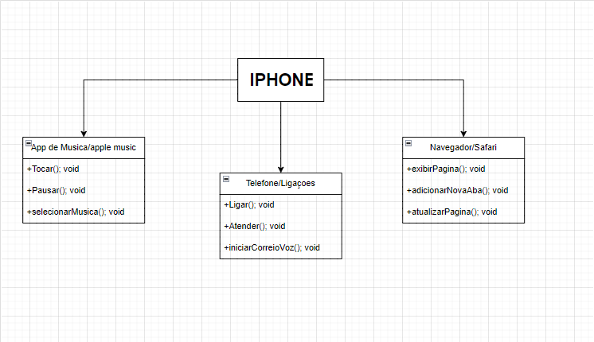

<h1>Diagrama UML do iPhone - Reprodutor Musical, Aparelho Telefônico e Navegador na Internet</h1>

<a>Este projeto apresenta um diagrama UML que modela as funcionalidades básicas do iPhone, especificamente como um Reprodutor Musical, Aparelho Telefônico e Navegador na Internet. O objetivo deste exercício é aplicar conceitos de Programação Orientada a Objetos (POO) e análise de sistemas na construção de um modelo que representa as interações e responsabilidades dessas funcionalidades.</a>

 

 <a>O diagrama UML foi criado para ilustrar a relação entre as interfaces e as classes. As interfaces (app de musica: Tocar();, Pausar();, selecionarMusica(); Telefone/Ligaçoes: Ligar(); Atender(); iniciarCorreioVoz(); e Navegador/Safari: exibirPagina(); adicionarNovaAba(); atualizarPagina();) definem as operações , enquanto as classes concretas (App de msuica/Apple Music, Telefone/Ligaçoes, Navegador/Safari) implementam essas operações. A classe IPhone atua como o ponto central que utiliza essas funcionalidades.</a>